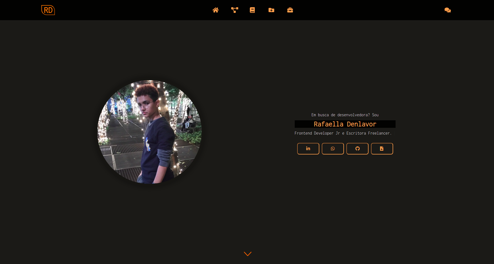

# portfolio

### Tela inicial

> Portfolio de desenvolvido para promover e divulgar livros, projetos e serviços como: Criação de Site, Apresentação, Escrita Criativa e Revisão Ortográfica. Além contar com as minhas redes sociais e currículo para download.
### Ajustes e melhorias
O projeto ainda está em desenvolvimento e as próximas atualizações serão voltadas nas seguintes tarefas:
- [x] Criação da seção de habilidades
- [ ] Aprimorar rodape
- [ ] Melhoria e troca das extensões das imagens
- [ ] Responsividade
- [ ] Acessibilidade
## Pré-requisitos
Antes de começar, verifique se você atendeu aos seguintes requisitos:
* Você instalou a versão mais recente da IDE `Visual Studio Code`?
* Você instalou o `Git`?
## Contribuindo para <portfolio>
Para contribuir com <portfolio>, siga estas etapas:
1. Bifurque este repositório.
2. Crie um branch: `git checkout -b <nome_branch>`.
3. Faça suas alterações e confirme-as: `git commit -m '<mensagem_commit>'`
4. Envie para o branch original: `git push origin <portfolio> / <local>`
5. Crie a solicitação de pull.
Como alternativa, consulte a documentação do GitHub em [como criar uma solicitação pull](https://help.github.com/en/github/collaborating-with-issues-and-pull-requests/creating-a-pull-request).
## Colaboradores
Agradecemos às seguintes pessoas que contribuíram para este projeto:
<table>
  <tr>
    <td align="center">
      <a href="https://rafa-denlavor.github.io/portfolio-v2.0/#">
         
        
          <b>Rafaella Denlavor</b>
        
      </a>
    </td>
  </tr>
</table>

## Licença
Esse projeto está sob licença. Veja o arquivo [LICENÇA](LICENSE.md) para mais detalhes.
[:seta_para_cima: Voltar ao topo](#portfolio-v2.0) 

## Tecnologias utilizadas: 

   

  

